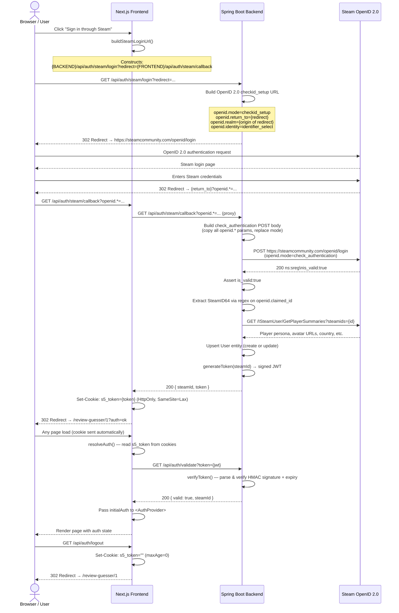

# Authentication Flow — Steam5

> **Audience:** New developers onboarding to the Steam5 project who need a complete, code-level understanding of how authentication works end-to-end.

---

## Table of Contents

1. [Overview](#1-overview)
2. [Architecture Diagram](#2-architecture-diagram)
3. [Key Files Reference](#3-key-files-reference)
4. [Environment Variables & Configuration](#4-environment-variables--configuration)
5. [Steam OpenID 2.0 Deep Dive](#5-steam-openid-20-deep-dive)
   - 5.1 [Login Initiation — `GET /api/auth/steam/login`](#51-login-initiation--get-apiauthsteamlogin)
   - 5.2 [Callback & Verification — `GET /api/auth/steam/callback`](#52-callback--verification--get-apiauthsteamcallback)
6. [JWT Token System](#6-jwt-token-system)
   - 6.1 [Key Derivation](#61-key-derivation)
   - 6.2 [Token Generation](#62-token-generation)
   - 6.3 [Token Verification](#63-token-verification)
7. [Cookie Mechanics](#7-cookie-mechanics)
8. [User Profile Creation (First Login / Upsert)](#8-user-profile-creation-first-login--upsert)
9. [Spring Security Configuration](#9-spring-security-configuration)
   - 9.1 [Filter Chain](#91-filter-chain)
   - 9.2 [Admin Token Filter](#92-admin-token-filter)
10. [Frontend Auth State Management](#10-frontend-auth-state-management)
    - 10.1 [Server-Side Initial Auth Resolution](#101-server-side-initial-auth-resolution)
    - 10.2 [React AuthContext](#102-react-authcontext)
    - 10.3 [Steam Login Button](#103-steam-login-button)
11. [Next.js API Route Layer](#11-nextjs-api-route-layer)
12. [Token Usage in Authenticated API Requests](#12-token-usage-in-authenticated-api-requests)
13. [Logout Flow](#13-logout-flow)
14. [Admin Authentication](#14-admin-authentication)
15. [Security Properties Summary](#15-security-properties-summary)
16. [Testing & Verification](#16-testing--verification)

---

## 1. Overview

Steam5 uses **Steam OpenID 2.0** for authentication. There are **no local user passwords** — identity is entirely delegated to Steam. After Steam verifies a user, the backend issues a signed **JWT** which the frontend stores as an **HttpOnly cookie** (`s5_token`).

| Concern | Solution |
|---------|----------|
| Identity / login | Steam OpenID 2.0 |
| Session token | Stateless JWT (HMAC-SHA256) |
| Token storage | HttpOnly, SameSite=Lax cookie |
| Passwords | None — Steam handles credentials |
| Token expiry | 30 days |
| Admin access | Separate shared-secret header (`X-Admin-Token`) |

The architecture is a **two-tier proxy**: the browser talks to the **Next.js** frontend server (App Router), which in turn talks to the **Spring Boot** backend API. The frontend never exposes the JWT to client-side JavaScript.

---

## 2. Architecture Diagram



---

## 3. Key Files Reference

| File | Layer | Purpose |
|------|-------|---------|
| `backend/src/main/java/org/steam5/web/AuthController.java` | Backend | Login redirect, OpenID callback, JWT validate endpoints |
| `backend/src/main/java/org/steam5/service/AuthTokenService.java` | Backend | JWT generation and verification (HMAC-SHA256) |
| `backend/src/main/java/org/steam5/security/AdminTokenFilter.java` | Backend | Spring Security filter for `X-Admin-Token` header |
| `backend/src/main/java/org/steam5/config/SecurityConfig.java` | Backend | Spring Security filter chain, endpoint protection rules |
| `backend/src/main/java/org/steam5/domain/User.java` | Backend | User JPA entity (steamId as PK, no password field) |
| `backend/src/main/java/org/steam5/service/SteamUserService.java` | Backend | Upsert user profile from Steam GetPlayerSummaries API |
| `backend/src/main/resources/application.yml` | Backend | Auth config (`auth.jwtSecret`, `auth.redirectBase`, etc.) |
| `frontend/app/layout.tsx` | Frontend | Root layout — server-side `resolveAuth()`, wraps app in `<AuthProvider>` |
| `frontend/app/api/auth/steam/callback/route.ts` | Frontend | Next.js API route — proxies callback to backend, sets cookie |
| `frontend/app/api/auth/me/route.ts` | Frontend | Next.js API route — checks token validity (used by SWR polling) |
| `frontend/app/api/auth/logout/route.ts` | Frontend | Next.js API route — clears cookie, redirects to home |
| `frontend/src/contexts/AuthContext.tsx` | Frontend | React Context providing `isSignedIn`, `steamId`, `refreshAuth()` |
| `frontend/src/components/SteamLoginButton.tsx` | Frontend | Login button component + `buildSteamLoginUrl()` helper |
| `frontend/src/components/AuthLogoutLink.tsx` | Frontend | Logout link (only visible when authenticated) |
| `frontend/app/review-guesser/[round]/actions.ts` | Frontend | Server Action — reads cookie and sends `Authorization: Bearer` to backend |

---

## 4. Environment Variables & Configuration

### Backend (`application.yml`)

```yaml
auth:
  jwtSecret: ${auth.jwtSecret:change-me-please-change-me-32-bytes-min}
  redirectBase: ${REDIRECT_BASE:http://localhost:3000}

admin:
  api-token: ${ADMIN_API_TOKEN:}
```

| Variable | Default | Required | Description |
|----------|---------|----------|-------------|
| `auth.jwtSecret` | `change-me-please-change-me-32-bytes-min` | **Yes (in prod)** | HMAC key for signing JWTs. Must be ≥32 bytes (256 bits). |
| `REDIRECT_BASE` | `http://localhost:3000` | Yes | Base URL of the frontend, used to build the default OpenID `return_to` URL. |
| `ADMIN_API_TOKEN` | _(empty)_ | For admin endpoints | Shared secret for `X-Admin-Token` header. If empty, all admin calls are rejected. |

> **Security:** The default JWT secret is intentionally weak. **Always** set a strong, random `auth.jwtSecret` in production (e.g., `openssl rand -base64 48`).

### Frontend (`.env.local` / runtime environment)

| Variable | Default | Description |
|----------|---------|-------------|
| `NEXT_PUBLIC_API_DOMAIN` | `http://localhost:8080` | Backend API base URL. Used to construct all `fetch()` calls to the Spring Boot server. |
| `NEXT_PUBLIC_DOMAIN` | `https://steam5.org` | Frontend public origin. Used to construct the OpenID `redirect` callback URL. |

---

## 5. Steam OpenID 2.0 Deep Dive

Steam OpenID 2.0 is an **identity federation protocol**. The user proves their identity to Steam (they know their Steam password), and Steam asserts that identity back to the application via a signed redirect. The application never handles or sees the user's Steam password.

This is **not** OAuth 2.0. There are no `access_token` or `refresh_token` concepts — only an identity assertion (who is this user?).

### 5.1 Login Initiation — `GET /api/auth/steam/login`

**File:** `backend/src/main/java/org/steam5/web/AuthController.java:85–98`

```java
@GetMapping("/steam/login")
public ResponseEntity<Void> startLogin(
        @RequestParam(value = "redirect", required = false) String redirect,
        jakarta.servlet.http.HttpServletRequest request) {

    // return_to is where Steam sends the user after login
    final String returnTo = (redirect == null || redirect.isBlank())
            ? defaultRedirectBase + "/api/auth/steam/callback"
            : redirect;

    // realm MUST be the origin (scheme://host[:port]) of return_to
    final String realm = deriveOriginSafe(returnTo, defaultRedirectBase);

    final String url = OPENID_ENDPOINT + "?openid.ns=" + enc("http://specs.openid.net/auth/2.0")
            + "&openid.mode=checkid_setup"
            + "&openid.return_to=" + enc(returnTo)
            + "&openid.realm=" + enc(realm)
            + "&openid.identity=" + enc("http://specs.openid.net/auth/2.0/identifier_select")
            + "&openid.claimed_id=" + enc("http://specs.openid.net/auth/2.0/identifier_select");

    return ResponseEntity.status(302).location(URI.create(url)).build();
}
```

The constructed redirect to Steam looks like:

```
https://steamcommunity.com/openid/login
  ?openid.ns=http%3A%2F%2Fspecs.openid.net%2Fauth%2F2.0
  &openid.mode=checkid_setup
  &openid.return_to=https%3A%2F%2Fsteam5.org%2Fapi%2Fauth%2Fsteam%2Fcallback
  &openid.realm=https%3A%2F%2Fsteam5.org
  &openid.identity=http%3A%2F%2Fspecs.openid.net%2Fauth%2F2.0%2Fidentifier_select
  &openid.claimed_id=http%3A%2F%2Fspecs.openid.net%2Fauth%2F2.0%2Fidentifier_select
```

| Parameter | Value | Meaning |
|-----------|-------|---------|
| `openid.ns` | `http://specs.openid.net/auth/2.0` | OpenID 2.0 namespace |
| `openid.mode` | `checkid_setup` | Interactive login (shows Steam login UI) |
| `openid.return_to` | `{redirect}` param or default | Where Steam redirects back after login |
| `openid.realm` | Origin of `return_to` | Trusted domain — must match `return_to` origin |
| `openid.identity` / `openid.claimed_id` | `identifier_select` | Tells Steam to let the user pick their identity |

After the user authenticates on Steam, Steam performs a redirect back to `openid.return_to` with a set of `openid.*` assertion parameters appended as query strings.

### 5.2 Callback & Verification — `GET /api/auth/steam/callback`

**File:** `backend/src/main/java/org/steam5/web/AuthController.java:100–154`

This endpoint receives Steam's assertion redirect and **verifies it is genuine** before trusting it.

#### Step 1: Build `check_authentication` request body

```java
private static String buildCheckAuthBody(Map<String, String> params) {
    MultiValueMap<String, String> form = new LinkedMultiValueMap<>();
    // Copy ALL openid.* params back to Steam, EXCEPT mode
    for (Map.Entry<String, String> e : params.entrySet()) {
        final String key = e.getKey();
        if (key.startsWith("openid.") && !"openid.mode".equals(key)) {
            form.add(key, e.getValue());
        }
    }
    // Replace mode with check_authentication
    form.add("openid.mode", "check_authentication");
    // ... URL-encode and join with &
}
```

All the `openid.*` parameters Steam sent are reflected back **verbatim** to Steam in a `POST` request, with `openid.mode` replaced with `check_authentication`. This is the OpenID 2.0 "direct verification" (also called "dumb mode" verification).

#### Step 2: POST to Steam

```java
try (HttpClient client = HttpClient.newBuilder()
        .followRedirects(HttpClient.Redirect.NEVER)  // Never follow redirects from Steam
        .build()) {
    final HttpRequest req = HttpRequest.newBuilder()
            .uri(URI.create(opEndpoint))             // https://steamcommunity.com/openid/login
            .header(HttpHeaders.CONTENT_TYPE, MediaType.APPLICATION_FORM_URLENCODED_VALUE)
            .header(HttpHeaders.ACCEPT, "text/plain")
            .header(HttpHeaders.ACCEPT_ENCODING, "identity")
            .header(HttpHeaders.USER_AGENT, "steam5-auth/1.0")
            .POST(HttpRequest.BodyPublishers.ofString(body))
            .build();
    res = client.send(req, HttpResponse.BodyHandlers.ofString(StandardCharsets.UTF_8));
}
```

Note `followRedirects(NEVER)` — if Steam tries to redirect the verification POST, it is treated as a failure (redirects from Steam at this point are anomalous and must not be silently followed).

#### Step 3: Assert `is_valid:true`

```java
if (res.statusCode() != 200 || resBody == null || !resBody.contains("is_valid:true")) {
    log.warn("Steam OpenID verification failed: status={} ...", res.statusCode(), ...);
    return ResponseEntity.status(401).body(Map.of("error", "invalid_openid"));
}
```

Steam's response body is a plain-text key-value format:

```
ns:http://specs.openid.net/auth/2.0
is_valid:true
```

If Steam says `is_valid:false` or anything other than `is_valid:true`, the login is rejected with `401`.

#### Step 4: Extract SteamID64

```java
private static final Pattern STEAM_ID_PATTERN =
    Pattern.compile("https://steamcommunity.com/openid/id/([0-9]{17})");

final String claimed = params.get("openid.claimed_id");
final Matcher m = STEAM_ID_PATTERN.matcher(claimed);
if (!m.find()) {
    return ResponseEntity.badRequest().body(Map.of("error", "invalid_claimed_id"));
}
final String steamId = m.group(1);  // e.g. "76561198012345678"
```

Steam encodes the user's 64-bit Steam ID in the `openid.claimed_id` URL path:

```
https://steamcommunity.com/openid/id/76561198012345678
```

The regex `([0-9]{17})` captures exactly 17 digits — the SteamID64 format.

#### Step 5: Issue JWT

```java
steamUserService.updateUserProfile(steamId);          // Upsert user in DB
final String token = tokenService.generateToken(steamId);
return ResponseEntity.ok(Map.of("steamId", steamId, "token", token));
```

The backend returns `{ steamId, token }` as JSON. The Next.js callback route then sets the token as an HttpOnly cookie (see §7).

---

## 6. JWT Token System

**File:** `backend/src/main/java/org/steam5/service/AuthTokenService.java`

The project uses the [jjwt](https://github.com/jwtk/jjwt) library (`io.jsonwebtoken:jjwt-api` + `jjwt-impl` + `jjwt-jackson`).

### 6.1 Key Derivation

```java
public AuthTokenService(
        @Value("${auth.jwtSecret:change-me-please-change-me-32-bytes-min}") String secret) {
    // Keys.hmacShaKeyFor() derives an appropriate HMAC key from raw bytes.
    // The algorithm is chosen based on key length:
    //   ≥32 bytes → HS256
    //   ≥48 bytes → HS384
    //   ≥64 bytes → HS512
    this.key = Keys.hmacShaKeyFor(secret.getBytes(StandardCharsets.UTF_8));
}
```

`Keys.hmacShaKeyFor()` (from jjwt) takes raw bytes and wraps them into a `SecretKey`. The HMAC algorithm selected depends on key length. With the default 32-byte (256-bit) secret, the algorithm is **HMAC-SHA256 (HS256)**.

> The key is derived once at application startup and reused for all token operations. It is held in memory only — never written to disk or logged.

### 6.2 Token Generation

```java
public String generateToken(String steamId) {
    Instant now = Instant.now();
    Instant exp = now.plusSeconds(60L * 60L * 24L * 30L); // 30 days

    return Jwts.builder()
            .subject(steamId)          // JWT "sub" claim — the user's SteamID64
            .issuedAt(Date.from(now))  // JWT "iat" claim — when the token was issued
            .expiration(Date.from(exp))// JWT "exp" claim — when the token expires
            .signWith(key)             // Signs with the HMAC key derived above
            .compact();                // Produces the compact serialization: header.payload.signature
}
```

A decoded JWT payload looks like:

```json
{
  "sub": "76561198012345678",
  "iat": 1712880000,
  "exp": 1715472000
}
```

The token is a standard three-part base64url-encoded string:

```
eyJhbGciOiJIUzI1NiJ9          ← header  ({"alg":"HS256"})
.eyJzdWIiOiI3NjU2MTE5ODAxMjM0NTY3OCIsImlhdCI6MTcxMjg4MDAwMCwiZXhwIjoxNzE1NDcyMDAwfQ
                                ← payload (claims above)
.HMAC_SIGNATURE                 ← signature (HMAC-SHA256 of header+payload with the key)
```

### 6.3 Token Verification

```java
public String verifyToken(String token) {
    try {
        return Jwts.parser()
                .verifyWith(key)        // Set the key for signature verification
                .build()
                .parseSignedClaims(token)
                // ↑ This call does all of the following atomically:
                //   1. Decode the header/payload from base64url
                //   2. Recompute HMAC-SHA256(header+payload, key)
                //   3. Compare with the signature in the token (timing-safe compare internally)
                //   4. Verify "exp" claim has not passed
                //   5. Throw JwtException on any failure
                .getPayload()
                .getSubject();          // Returns the steamId ("sub" claim)
    } catch (Exception e) {
        log.debug("Token verification failed", e);
        return null;                    // null = invalid/expired token
    }
}
```

If the token has been tampered with (any bit changed in header, payload, or signature), the HMAC recomputation will produce a different value and the comparison will fail — the token is rejected. If the `exp` timestamp is in the past, `jjwt` throws `ExpiredJwtException` automatically.

---

## 7. Cookie Mechanics

**File:** `frontend/app/api/auth/steam/callback/route.ts`

After the backend returns `{ steamId, token }`, the Next.js callback API route sets the cookie:

```typescript
resp.cookies.set('s5_token', data.token, {
    httpOnly: true,           // Not readable by JavaScript (document.cookie) → prevents XSS theft
    sameSite: 'lax',          // Not sent on cross-site POSTs → mitigates CSRF
    secure: base.startsWith('https'),  // Only sent over HTTPS in production
    path: '/',                // Sent on all paths
    maxAge: 60 * 60 * 24 * 30,        // 2,592,000 seconds = 30 days
});
```

| Attribute | Value | Security Purpose |
|-----------|-------|-----------------|
| `httpOnly` | `true` | JavaScript (`document.cookie`) cannot read this cookie. Even if an attacker injects a `<script>`, they cannot steal the JWT. |
| `sameSite` | `lax` | Browser does not send the cookie on cross-origin `POST`/`PUT`/`DELETE` requests. Prevents Cross-Site Request Forgery (CSRF) for state-changing operations. `lax` still allows cross-site GETs (e.g., following links). |
| `secure` | true in prod | Cookie is only transmitted over encrypted HTTPS connections. Prevents interception on plain HTTP. |
| `path` | `/` | Cookie is sent for every request to the domain. |
| `maxAge` | 2,592,000 | Browser persists the cookie for 30 days, matching the JWT expiry. |

**Clearing the cookie on logout** (`frontend/app/api/auth/logout/route.ts`):

```typescript
resp.cookies.set('s5_token', '', {
    httpOnly: true,
    sameSite: 'lax',
    secure: base.startsWith('https'),
    path: '/',
    maxAge: 0,   // Instructs the browser to delete the cookie immediately
});
```

Setting `maxAge: 0` is the standard mechanism to delete a cookie — the browser removes it upon receiving this response.

---

## 8. User Profile Creation (First Login / Upsert)

**File:** `backend/src/main/java/org/steam5/service/SteamUserService.java`

There is **no explicit registration endpoint**. A user record is created (or updated) automatically every time they log in.

```java
@Transactional
public void updateUserProfile(String steamId) {
    final User existing = userRepository.findById(steamId).orElse(null);

    // Fetch public profile data from Steam's Web API
    final String url = "https://api.steampowered.com/ISteamUser/GetPlayerSummaries/v0002/"
            + "?key=" + apiKey + "&steamids=" + steamId;
    final String body = steamHttpClient.get(url);

    final JsonNode player = objectMapper.readTree(body)
            .path("response").path("players").get(0);

    final User user = existing != null ? existing : new User();
    user.setSteamId(steamId);
    user.setPersonaName(player.path("personaname").asText(null));
    user.setProfileUrl(player.path("profileurl").asText(null));
    user.setAvatar(player.path("avatar").asText(null));
    user.setAvatarFull(player.path("avatarfull").asText(null));
    // ... more fields ...
    userRepository.save(user);

    // If avatar changed, trigger async blurhash re-generation
    if (avatarChanged || avatarFullChanged) {
        eventPublisher.publishEvent(new BlurhashEncodeRequested(...));
    }
}
```

### User Entity (`User.java`)

```java
@Entity
@Table(name = "users", uniqueConstraints = @UniqueConstraint(columnNames = {"steam_id"}))
public class User {

    @Id
    @Column(name = "steam_id", nullable = false, length = 32)
    private String steamId;          // SteamID64, e.g. "76561198012345678"

    private String personaName;      // Display name on Steam
    private String profileUrl;       // https://steamcommunity.com/id/...
    private String avatar;           // 32x32 avatar URL (CDN)
    private String avatarFull;       // 184x184 avatar URL
    private String blurhashAvatar;   // Blurhash placeholder for avatar
    private String blurdataAvatar;   // Base64 data URI for avatar placeholder

    private Long   lastLogoffSec;    // Unix timestamp of last logoff
    private Integer personaState;   // Online status enum
    private String countryCode;      // ISO 3166-1 alpha-2, e.g. "DE"

    private OffsetDateTime createdAt;
    private OffsetDateTime updatedAt;

    @PrePersist
    public void prePersist() {
        if (createdAt == null) createdAt = OffsetDateTime.now();
        updatedAt = OffsetDateTime.now();
    }

    @PreUpdate
    public void preUpdate() {
        updatedAt = OffsetDateTime.now();
    }
}
```

Key design decisions:
- **`steamId` is the primary key** — no surrogate UUID needed since SteamID64 is globally unique and stable.
- **No password field** — identity is proven by Steam; we only store public profile data.
- **`@PrePersist` / `@PreUpdate`** — Hibernate lifecycle hooks automatically maintain `createdAt` / `updatedAt` without requiring manual calls.

---

## 9. Spring Security Configuration

### 9.1 Filter Chain

**File:** `backend/src/main/java/org/steam5/config/SecurityConfig.java`

```java
@Bean
public SecurityFilterChain securityFilterChain(HttpSecurity http, AdminTokenFilter adminTokenFilter) {
    http
        .csrf(AbstractHttpConfigurer::disable)  // JWT in cookie with SameSite=Lax replaces CSRF tokens
        .authorizeHttpRequests(auth -> auth
            .requestMatchers("/api/review-game/**").permitAll()
            .requestMatchers("/api/details/**").permitAll()
            .requestMatchers("/api/metrics/**").permitAll()
            .requestMatchers("/api/cache/**").permitAll()
            .requestMatchers("/api/leaderboard/**").permitAll()
            .requestMatchers("/api/profile/**").permitAll()
            .requestMatchers("/api/admin/**").authenticated()    // ← Admin requires auth
            .requestMatchers("/api/seasons/**").permitAll()
            .requestMatchers("/api/stats/**").permitAll()
            .requestMatchers("/api/auth/**").permitAll()         // ← Auth endpoints are public
            .anyRequest().authenticated()
        )
        .addFilterBefore(adminTokenFilter, BasicAuthenticationFilter.class)
        .httpBasic(basic -> {})
        .formLogin(AbstractHttpConfigurer::disable);
    return http.build();
}
```

Notable decisions:

- **CSRF disabled**: The combination of `SameSite=Lax` cookies and the fact that the backend API is consumed by a separate Next.js server (not a browser form) makes traditional CSRF tokens unnecessary.
- **Form login disabled**: No HTML login form — everything goes through Steam OpenID.
- **`/api/admin/**` requires `.authenticated()`**: Satisfied by `AdminTokenFilter` injecting a `ROLE_ADMIN` authentication into the `SecurityContext`.
- **Most endpoints are `permitAll()`**: Auth is handled at the application logic level for user-specific features (e.g., leaderboard submissions are allowed anonymously but associated with the user only if authenticated).

### 9.2 Admin Token Filter

**File:** `backend/src/main/java/org/steam5/security/AdminTokenFilter.java`

```java
@Component
public class AdminTokenFilter extends OncePerRequestFilter {

    private static final String ADMIN_HEADER = "X-Admin-Token";
    private static final String ADMIN_PATH_PREFIX = "/api/admin/";

    @Override
    protected boolean shouldNotFilter(HttpServletRequest request) {
        // Only runs for /api/admin/** paths; skip OPTIONS (CORS preflight)
        return "OPTIONS".equalsIgnoreCase(request.getMethod())
            || !path.startsWith(ADMIN_PATH_PREFIX);
    }

    @Override
    protected void doFilterInternal(...) {
        if (!StringUtils.hasText(expectedToken)) {
            response.sendError(SC_UNAUTHORIZED, "Unauthorized");  // No token configured → reject all
            return;
        }

        String providedToken = request.getHeader(ADMIN_HEADER);
        if (!StringUtils.hasText(providedToken) || !expectedToken.equals(providedToken)) {
            response.sendError(SC_UNAUTHORIZED, "Unauthorized");
            return;
        }

        // Token matches → inject ROLE_ADMIN into SecurityContext
        SecurityContext context = SecurityContextHolder.createEmptyContext();
        context.setAuthentication(new UsernamePasswordAuthenticationToken(
            "admin-token",
            null,
            List.of(new SimpleGrantedAuthority("ROLE_ADMIN"))
        ));
        SecurityContextHolder.setContext(context);
        filterChain.doFilter(request, response);
    }
}
```

This filter runs before `BasicAuthenticationFilter`. When a valid `X-Admin-Token` header is present on `/api/admin/**`, it creates a `UsernamePasswordAuthenticationToken` with `ROLE_ADMIN` authority and places it in the `SecurityContextHolder`. Spring Security's `authorizeHttpRequests` rule `.requestMatchers("/api/admin/**").authenticated()` is then satisfied by this injected token.

---

## 10. Frontend Auth State Management

### 10.1 Server-Side Initial Auth Resolution

**File:** `frontend/app/layout.tsx:170–213`

Every full-page render in Next.js starts here. The root layout performs a **server-side** auth check before the page is sent to the browser:

```typescript
async function resolveAuth() {
    const cookieStore = await cookies();
    const token = cookieStore.get('s5_token')?.value;

    if (!token) return { isSignedIn: false };

    // Validate with backend — result is cached for 60s by Next.js
    const res = await fetch(
        `${BACKEND_ORIGIN}/api/auth/validate?token=${encodeURIComponent(token)}`,
        {
            headers: { 'accept': 'application/json' },
            next: { revalidate: 60 },
        }
    );
    if (!res.ok) return { isSignedIn: false };

    const data = await res.json();
    return {
        isSignedIn: Boolean(data?.valid),
        steamId: data?.steamId || null,
    };
}

export default async function RootLayout({ children }) {
    const authState = await resolveAuth();   // Server-side auth check
    return (
        <html>
          <body>
            <AuthProvider initialAuth={authState}>   {/* Passed to React tree */}
              {children}
            </AuthProvider>
          </body>
        </html>
    );
}
```

This means the **initial HTML rendered by Next.js already contains the correct auth state** — no flash of unauthenticated content on page load. The `next: { revalidate: 60 }` cache hint means Next.js will re-use the backend response for up to 60 seconds for server renders (reducing backend load on high-traffic pages).

### 10.2 React AuthContext

**File:** `frontend/src/contexts/AuthContext.tsx`

```typescript
type AuthState = {
    isSignedIn: boolean;
    steamId?: string | null;
    isLoading?: boolean;
};

export function AuthProvider({ children, initialAuth }: { children: ReactNode; initialAuth: AuthState }) {
    const [auth, setAuth] = useState<AuthState>(initialAuth);

    // SWR polls /api/auth/me for client-side freshness
    const { data, mutate } = useSWR<AuthState>('/api/auth/me', authFetcher, {
        fallbackData: initialAuth,    // No loading flicker — use server-provided initial state
        revalidateOnFocus: false,     // Don't re-check just because user tabbed back
        dedupingInterval: 30000,      // Deduplicate identical requests within 30s window
        errorRetryCount: 2,           // Retry twice on network error before giving up
    });

    useEffect(() => {
        if (data) setAuth(data);      // Sync local state when SWR updates
    }, [data]);

    const refreshAuth = useCallback(() => void mutate(), [mutate]);

    return (
        <AuthContext.Provider value={{ ...auth, refreshAuth }}>
            {children}
        </AuthContext.Provider>
    );
}
```

**Exported hooks:**

```typescript
// Full auth state + refresh function
export function useAuth(): AuthContextType

// Backward-compatible: returns true/false/null (null = loading)
export function useAuthSignedIn(): boolean | null
```

The `null` return from `useAuthSignedIn()` is important: it signals "we don't know yet", allowing components to avoid rendering auth-dependent UI during the hydration phase.

### 10.3 Steam Login Button

**File:** `frontend/src/components/SteamLoginButton.tsx`

```typescript
export function buildSteamLoginUrl(): string {
    const backend = process.env.NEXT_PUBLIC_API_DOMAIN || 'http://localhost:8080';
    // Use NEXT_PUBLIC_DOMAIN env var if set, otherwise fall back to window.location.origin
    const envBase = process.env.NEXT_PUBLIC_DOMAIN;
    const callbackBase = (typeof window !== 'undefined' && (!envBase || envBase.length === 0))
        ? window.location.origin
        : (envBase || '');
    const callback = `${callbackBase}/api/auth/steam/callback`;
    return `${backend}/api/auth/steam/login?redirect=${encodeURIComponent(callback)}`;
}
```

This constructs the full login URL, e.g.:

```
http://localhost:8080/api/auth/steam/login?redirect=https%3A%2F%2Fsteam5.org%2Fapi%2Fauth%2Fsteam%2Fcallback
```

The backend uses the `redirect` parameter as the OpenID `return_to` value — Steam will redirect back to this Next.js URL after login.

On successful login, the component clears `localStorage` (which holds local game state from anonymous sessions):

```typescript
useEffect(() => {
    if (isSignedIn && !clearedRef.current) {
        clearedRef.current = true;
        try { clearAll(); } catch { /* ignore */ }
    }
}, [isSignedIn]);
```

---

## 11. Next.js API Route Layer

The Next.js API routes act as a **thin proxy/adapter** between the browser and the Spring Boot backend. This layer is necessary because:

1. The JWT token lives in an HttpOnly cookie — JavaScript can't read it.
2. The Next.js server can read cookies and forward them to the backend as `Authorization: Bearer` headers.
3. It avoids exposing the backend URL directly to the browser in sensitive auth flows.

### `GET /api/auth/steam/callback`

**File:** `frontend/app/api/auth/steam/callback/route.ts`

```typescript
export async function GET(req: NextRequest) {
    const url = new URL(req.url);
    const qs = url.searchParams.toString();
    // Proxy all ?openid.* params to the Spring Boot backend
    const verifyUrl = `${BACKEND_ORIGIN}/api/auth/steam/callback${qs ? `?${qs}` : ''}`;

    const res = await fetch(verifyUrl, { headers: { accept: 'application/json' } });

    if (!res.ok) {
        return NextResponse.redirect(new URL('/review-guesser/1?auth=failed', base));
    }

    const data = await res.json() as { steamId: string; token: string };
    const resp = NextResponse.redirect(new URL('/review-guesser/1?auth=ok', base));

    // Set the JWT as an HttpOnly cookie — browser JavaScript cannot access this
    resp.cookies.set('s5_token', data.token, {
        httpOnly: true,
        sameSite: 'lax',
        secure: base.startsWith('https'),
        path: '/',
        maxAge: 60 * 60 * 24 * 30,
    });
    return resp;
}
```

### `GET /api/auth/me`

**File:** `frontend/app/api/auth/me/route.ts`

Used by the SWR client-side polling. Reads the cookie on the server, validates with the backend, returns JSON:

```typescript
export async function GET() {
    const token = (await cookies()).get('s5_token')?.value;
    if (!token) return NextResponse.json({ signedIn: false }, { status: 200 });

    const res = await fetch(
        `${BACKEND_ORIGIN}/api/auth/validate?token=${encodeURIComponent(token)}`,
        { cache: 'no-store' }   // Always fresh — used to detect expired tokens
    );
    if (!res.ok) return NextResponse.json({ signedIn: false }, { status: 200 });

    const data = await res.json();
    return NextResponse.json({ signedIn: Boolean(data.valid), steamId: data.steamId });
}
```

### `GET /api/auth/logout`

**File:** `frontend/app/api/auth/logout/route.ts`

```typescript
export async function GET(req: NextRequest) {
    const resp = NextResponse.redirect(new URL('/review-guesser/1', base));
    resp.cookies.set('s5_token', '', {
        httpOnly: true,
        sameSite: 'lax',
        secure: base.startsWith('https'),
        path: '/',
        maxAge: 0,    // maxAge=0 tells the browser to delete the cookie
    });
    return resp;
}
```

---

## 12. Token Usage in Authenticated API Requests

The browser never sends the JWT directly — the Next.js server reads it from the cookie and forwards it as a standard `Authorization: Bearer` header to the Spring Boot backend.

### Server Actions (Form Submissions)

**File:** `frontend/app/review-guesser/[round]/actions.ts`

```typescript
'use server';

export async function submitGuessAction(_prev, formData: FormData) {
    const token = (await cookies()).get('s5_token')?.value;

    // Route to different endpoint based on auth state
    const url = token
        ? `${backend}/api/review-game/guess-auth`   // Authenticated: saved to user's history
        : `${backend}/api/review-game/guess`;        // Anonymous: not persisted

    const headers: Record<string, string> = {
        'content-type': 'application/json',
        'accept': 'application/json',
    };
    if (token) headers['authorization'] = `Bearer ${token}`;

    const res = await fetch(url, { method: 'POST', headers, body: JSON.stringify(...) });
    // ...
}
```

### Server-Side Data Fetching (API Routes)

```typescript
// frontend/app/api/review-game/my/today/route.ts
export async function GET() {
    const token = (await cookies()).get('s5_token')?.value;
    if (!token) return NextResponse.json([], { status: 200 });

    const res = await fetch(`${BACKEND_ORIGIN}/api/review-game/my/today`, {
        headers: {
            'accept': 'application/json',
            'authorization': `Bearer ${token}`,
        },
        cache: 'no-store',
    });
    // ...
}
```

The Spring Boot backend extracts and validates the Bearer token in the relevant controllers. The `GET /api/auth/validate` endpoint is the dedicated validation path, but individual controllers can call `AuthTokenService.verifyToken()` directly.

---

## 13. Logout Flow

```mermaid
sequenceDiagram
    actor User
    participant FE as Next.js Frontend
    participant Browser

    User->>FE: Click logout link (href="/api/auth/logout")
    Note over FE: AuthLogoutLink renders <a href="/api/auth/logout">
    FE->>FE: GET /api/auth/logout (Next.js API route)
    FE->>Browser: Set-Cookie: s5_token=""; maxAge=0
    FE-->>User: 302 Redirect → /review-guesser/1
    Browser->>Browser: Delete s5_token cookie
    Browser->>FE: GET /review-guesser/1 (no s5_token cookie)
    FE->>FE: resolveAuth() → isSignedIn: false
    FE-->>User: Page rendered as unauthenticated
```

`AuthLogoutLink` is intentionally a plain `<a>` tag (not Next.js `<Link>`):

```typescript
// frontend/src/components/AuthLogoutLink.tsx
export default function AuthLogoutLink() {
    const signedIn = useAuthSignedIn();
    if (!signedIn) return null;
    // Plain <a> avoids Next.js prefetching the logout route
    return <a href="/api/auth/logout" className="btn">Logout</a>;
}
```

---

## 14. Admin Authentication

Admin authentication is **completely separate** from user authentication and does not use Steam or JWTs.

**File:** `backend/src/main/java/org/steam5/security/AdminTokenFilter.java`

```
Request to /api/admin/** with header:
  X-Admin-Token: {ADMIN_API_TOKEN env value}
```

The filter:
1. Checks the header value against the configured `admin.api-token`.
2. If they match, injects `ROLE_ADMIN` into the Spring `SecurityContext`.
3. If they don't match (or the token is unconfigured), returns `401 Unauthorized` immediately.

**Usage example:**

```bash
curl -H "X-Admin-Token: my-secret-admin-token" \
     https://steam5.org/api/admin/seasons/backfill
```

Protected admin endpoints: `/api/admin/seasons/backfill`, `/api/admin/seasons/{seasonId}/finalize`.

---

## 15. Security Properties Summary

| Property | Implementation | Threat Mitigated |
|----------|---------------|-----------------|
| No passwords stored | Steam OpenID — identity delegated to Steam | Credential database breaches |
| HttpOnly cookie | `httpOnly: true` on `s5_token` | XSS cannot steal the token via `document.cookie` |
| SameSite=Lax | `sameSite: 'lax'` on `s5_token` | CSRF — cross-site requests don't carry the cookie |
| HTTPS-only cookie | `secure: true` in production | Man-in-the-middle interception of the token |
| HMAC signature on JWT | `Keys.hmacShaKeyFor(secret)` + `signWith(key)` | Token forgery — cannot create a valid token without the secret |
| JWT expiry | `exp` claim set to 30 days | Stolen tokens expire automatically |
| OpenID `check_authentication` | POST to Steam with `is_valid:true` assertion | Replay attacks — Steam validates each assertion is fresh |
| `followRedirects(NEVER)` | Java `HttpClient` config in callback | Prevents redirect-based attacks during OpenID verification |
| SteamID64 regex | `[0-9]{17}` on `openid.claimed_id` | Injection via malformed claimed ID |
| Admin separate token | `X-Admin-Token` header filter | Admin endpoints not accessible via user JWTs |

**Known limitations / things to review for production:**

- No **token refresh** mechanism — users must re-authenticate after 30 days.
- Admin token is a **plain string comparison** (not constant-time in all JVM implementations — consider `MessageDigest.isEqual` for timing safety).
- JWT secret must be ≥32 bytes (256 bits). Use `openssl rand -base64 48` to generate a strong secret.
- There is no **token revocation** — if a token is stolen, it remains valid until expiry. Consider adding a token blocklist (Redis) if revocation is needed.

---

## 16. Testing & Verification

### Manual curl walkthrough

**Step 1: Start the login flow**

```bash
# This will redirect to Steam — follow with -L to see where it goes
curl -v "http://localhost:8080/api/auth/steam/login?redirect=http://localhost:3000/api/auth/steam/callback" 2>&1 | grep Location
# → Location: https://steamcommunity.com/openid/login?openid.ns=...
```

**Step 2: Validate an existing token**

```bash
# Replace TOKEN with a real JWT from the s5_token cookie after login
TOKEN="eyJhbGciOiJIUzI1NiJ9...."

curl -s "http://localhost:8080/api/auth/validate?token=${TOKEN}" | jq .
# → { "valid": true, "steamId": "76561198012345678" }

# With an expired/invalid token:
curl -s "http://localhost:8080/api/auth/validate?token=bad.token.here" | jq .
# → { "valid": false }  (HTTP 401)
```

**Step 3: Check auth state from the frontend layer**

```bash
# Pass the cookie as it would appear in a browser
curl -s -H "Cookie: s5_token=${TOKEN}" http://localhost:3000/api/auth/me | jq .
# → { "signedIn": true, "steamId": "76561198012345678" }
```

**Step 4: Test logout**

```bash
curl -v -H "Cookie: s5_token=${TOKEN}" http://localhost:3000/api/auth/logout 2>&1 | grep -E "Location|Set-Cookie"
# → Set-Cookie: s5_token=; Max-Age=0; Path=/; HttpOnly; SameSite=Lax
# → Location: http://localhost:3000/review-guesser/1
```

**Step 5: Test admin endpoint**

```bash
# Without token → 401
curl -s -o /dev/null -w "%{http_code}" http://localhost:8080/api/admin/seasons/backfill
# → 401

# With correct token
curl -s -w "%{http_code}" \
     -H "X-Admin-Token: your-admin-token" \
     http://localhost:8080/api/admin/seasons/backfill
# → 200 (or appropriate response)
```

### Inspecting a JWT manually

```bash
TOKEN="eyJhbGciOiJIUzI1NiJ9.eyJzdWIiOiI3NjU2MTE5ODAx..."

# Decode the payload (middle segment) — note: this does NOT verify the signature
echo $TOKEN | cut -d. -f2 | base64 -d 2>/dev/null | jq .
# → {
#     "sub": "76561198012345678",
#     "iat": 1712880000,
#     "exp": 1715472000
#   }

# Check expiry
EXP=$(echo $TOKEN | cut -d. -f2 | base64 -d 2>/dev/null | jq .exp)
echo "Expires: $(date -d @$EXP)"
```

> **Note:** Decoding the payload locally does NOT validate the signature. Only the backend (`AuthTokenService.verifyToken()`) can validate the HMAC signature.
